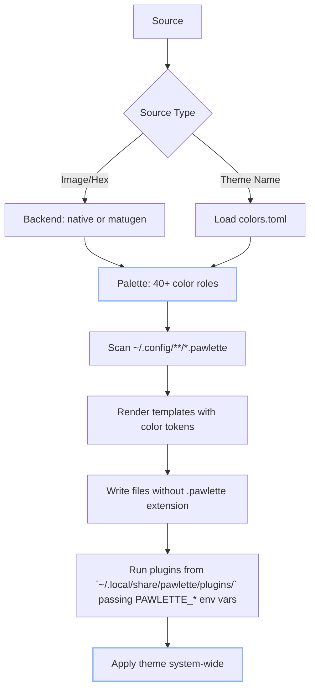

<div align="center">

# 🐾 Pawlette

**Universal Theme Manager for Linux** \
**Under the hood — flexible patching system and atomic operations.**

[](https://github.com/meowrch/pawlette/issues)
[](https://github.com/meowrch/pawlette/stargazers)
[](./LICENSE)

[](./README.ru.md)
[](./README.md)

</div>


## 🌟 Features

- **🎨 Dynamic Palettes** — Color extraction from wallpapers using a native PIL backend or [matugen](https://github.com/InioX/matugen) (Material You).
- **📦 Static Themes** — Built-in themes included (Catppuccin, Gruvbox, Nord). Custom themes supported.
- **🔧 Template Engine** — Place `.pawlette` files alongside your configs; pawlette renders them using color tokens and filters.
- **🗃️ Filter Support** — Apply special filters to color variables within templates.
- **🔌 Plugin System** — Drop executables into `plugins/`; they receive the palette via environment variables.
- **📂 XDG Compliant** — All paths follow the XDG Base Directory specification; fully overridable for testing.

## Installation

### Requirements

- Python 3.10+
- Pillow library
- [matugen](https://github.com/InioX/matugen) (optional, for Material You backend)

### Arch Linux

```bash
yay -S pawlette
```

### From Source

```bash
git clone https://github.com/meowrch/pawlette
cd pawlette
uv sync
uv run pawlette --help
```

## Quick Start

```bash
# Apply theme from wallpaper (native backend, dark mode)
pawlette apply image ~/wallpapers/mountain.jpg

# Apply with matugen backend and light mode
pawlette apply image ~/wallpapers/mountain.jpg --backend matugen --mode light

# Apply from hex color
pawlette apply hex "#cba6f7"

# Apply a static theme
pawlette apply theme catppuccin-mocha

# Re-render templates without re-extracting the palette
pawlette render
```

## How It Works

Pawlette follows a three-stage pipeline:



## Configuration

Configuration is optional. Create `~/.config/pawlette/pawlette.toml` to set default values:

```toml
# Default backend (overridden by --backend flag)
backend = "native"  # or "matugen"

# Default mode (overridden by --mode flag)
mode = "dark"  # or "light"

# Backend settings
[backends.matugen]
# Color preference when multiple dominant colors exist
prefer = "saturation"  # darkness, lightness, saturation, less-saturation, value, closest-to-fallback

# Fallback color for "closest-to-fallback"
fallback_color = "#cba6f7"

# Plugin settings
[plugins.telegram]
template_dir = "~/.config/tg-config/"
output = "~/.config/tg-config/pawlette.tdesktop-theme"
background_image = "~/Pictures/wallpaper.jpg"
```

See [`pawlette.toml.example`](pawlette.toml.example) for a full reference.

### CLI Priority

Settings are resolved in the following order:
1. CLI arguments (highest priority)
2. Configuration file (`pawlette.toml`)
3. Hardcoded defaults (lowest priority)

## Template System

### Creating Templates

Place `.pawlette` files near your configs. Pawlette scans `~/.config` recursively and renders them:

```
~/.config/polybar/config.ini          ← generated (do not edit)
~/.config/polybar/config.ini.pawlette ← template (edit this one)
```

### Template Syntax

Use `{{token}}` for color substitution with optional filters:

```ini
[colors]
background = {{color_bg}}
foreground = {{color_text}}
primary = {{color_primary}}
alert = {{color_red}}

# With filters
background-alt = {{color_bg | lighten 10}}
border = {{color_primary | alpha 80}}
rgb-color = {{color_primary | rgb}}
```

### Available Filters

| Filter | Example | Result |
|--------|--------|-----------|
| `alpha N` | `{{color_primary \| alpha 80}}` | `#cba6f7cc` (80% opacity) |
| `lighten N` | `{{color_bg \| lighten 20}}` | Lightened by 20% |
| `darken N` | `{{color_text \| darken 15}}` | Darkened by 15% |
| `strip` | `{{color_primary \| strip}}` | `cba6f7` (without #) |
| `rgb` | `{{color_primary \| rgb}}` | `203,166,247` |
| `uppercase` | `{{color_primary \| uppercase}}` | `#CBA6F7` |

### Filter Chaining

Combine multiple filters using `|`:

```
{{color_primary | darken 15 | strip}}                    → 9e7ec5
{{color_primary | darken 10 | strip | uppercase}}        → A882D4
{{color_bg | alpha 90 | uppercase}}                      → #1E1E2Ee6
```

### Template Examples

See [`examples/configs`](examples/configs) for ready-to-use templates:
- `alacritty/` — Terminal emulator
- `kitty/` — Terminal emulator
- `hyprland/` — Wayland compositor
- `gtk-3.0/`, `gtk-4.0/` — GTK themes
- `fish/`, `zsh/` — Shell themes

## Color Palette Reference

Pawlette provides 40+ color roles organized into three categories:

### UI Roles (13 colors)

| Variable | Description | Usage |
|------------|----------|---------------|
| `color_bg` | Deepest background | Window background, terminal background |
| `color_bg_alt` | Panels, sidebars | One step lighter than bg |
| `color_surface` | Buttons, input fields | Interactive elements |
| `color_surface_alt` | Hover / raised surface | Hover states, elevated cards |
| `color_text` | Main readable text | Primary text color |
| `color_text_muted` | Secondary text | Placeholders, descriptions |
| `color_text_subtle` | Disabled, captions | Disabled text, subtle hints |
| `color_primary` | Primary accent | Active tabs, highlights, links |
| `color_secondary` | Secondary accent | Alternative highlights |
| `color_border_active` | Active window border | Focused window border |
| `color_border_inactive`| Inactive window border | Unfocused window border |
| `color_cursor` | Terminal/Editor cursor | Cursor color |
| `color_selection_bg` | Text selection background | Highlighted text background |

### ANSI 16 (Terminal Colors)

| Variable | Description |
|------------|----------|
| `ansi_color0` | Black (terminal background) |
| `ansi_color1` | Red |
| `ansi_color2` | Green |
| `ansi_color3` | Yellow |
| `ansi_color4` | Blue |
| `ansi_color5` | Magenta |
| `ansi_color6` | Cyan |
| `ansi_color7` | White (terminal text) |
| `ansi_color8` | Bright Black (dim background) |
| `ansi_color9` | Bright Red |
| `ansi_color10` | Bright Green |
| `ansi_color11` | Bright Yellow |
| `ansi_color12` | Bright Blue |
| `ansi_color13` | Bright Magenta |
| `ansi_color14` | Bright Cyan |
| `ansi_color15` | Bright White (bright text) |

### Semantic Colors (6 colors)

**Always true hues** — never aliases of ANSI colors. Generated at fixed target hues (0°, 120°, 225°, etc.) using primary saturation.

| Variable | Hue | Usage |
|------------|---------|---------------|
| `color_red` | 0° | Errors, deletions, alerts |
| `color_green` | 120° | Success, additions, confirmations |
| `color_yellow` | 60° | Warnings, modifications |
| `color_blue` | 225° | Info, links, functions |
| `color_cyan` | 185° | Hints, strings |
| `color_magenta` | 300° | Special, keywords |

**Why semantic colors are generated:**

Material You (matugen) shifts ALL colors toward the dominant wallpaper hue. This breaks color associations:
- Red becomes pink on purple wallpapers.
- Green becomes mint on purple wallpapers.
- Git diffs and syntax highlighting become unrecognizable.

Pawlette generates semantic colors at **fixed hues** but uses **saturation/brightness from primary** for harmony. Result: colors are recognizable (red = red) but visually consistent.

## Plugin System

### How Plugins Work

Plugins are **any executable files** in `~/.local/share/pawlette/plugins/`:
- Shell scripts (`.sh`)
- Python scripts (`.py`)
- Compiled binaries

Pawlette runs them sequentially and passes the palette via environment variables.

### Plugin Contract

**Input:**
- Receives environment variables `PAWLETTE_COLOR_*` and `PAWLETTE_ANSI_COLOR*` (uppercase).
- Receives plugin-specific settings as `PAWLETTE_PLUGIN_*` variables from `[plugins.<name>]` in `pawlette.toml`.

**Output:**
- Exit code 0 = success.
- Non-zero = error (logged).
- Stdout/stderr are captured and logged.

**Timeout:** 30 seconds per plugin (configurable).

### Environment Variables

All palette colors are passed as uppercase environment variables:

```bash
# UI Roles
PAWLETTE_COLOR_BG="#1e1e2e"
...
# ANSI 16
PAWLETTE_ANSI_COLOR0="#1e1e2e"
...
# Semantic Colors
PAWLETTE_COLOR_RED="#f05b5b"
```

### Creating a Plugin

#### Example 1: Shell Script

```bash
#!/bin/bash
# ~/.local/share/pawlette/plugins/hyprland.sh

# Set Hyprland border colors
if pgrep -x "Hyprland" > /dev/null; then
    if command -v hyprctl &> /dev/null; then
        hyprctl keyword general:col.active_border "rgb(${PAWLETTE_COLOR_BORDER_ACTIVE#\#})"
        hyprctl keyword general:col.inactive_border "rgb(${PAWLETTE_COLOR_BORDER_INACTIVE#\#})"
    fi
fi

# Reload waybar
if pgrep -x "waybar" > /dev/null; then
    killall -SIGUSR2 waybar
fi
```

Make it executable:
```bash
chmod +x ~/.local/share/pawlette/plugins/hyprland.sh
```

#### Example 2: Python Script

```python
#!/usr/bin/env python3
# ~/.local/share/pawlette/plugins/gtk-theme.py

import os
import subprocess

primary = os.environ["PAWLETTE_COLOR_PRIMARY"]
bg = os.environ["PAWLETTE_COLOR_BG"]

# Apply GTK theme
subprocess.run(["gsettings", "set", "org.gnome.desktop.interface", "gtk-theme", "Adwaita-dark"])
subprocess.run(["gsettings", "set", "org.gnome.desktop.interface", "color-scheme", "prefer-dark"])

print(f"Applied GTK theme with primary={primary}")
```

**Note:** Python plugins don't need a shebang — pawlette calls them with the current interpreter automatically (with virtualenv support).

### Plugin Naming

The plugin name is derived from the filename (without extension):
- `telegram.py` → config section `[plugins.telegram]`
- `gtk-reload.sh` → config section `[plugins.gtk-reload]`

## Static Themes

### Using Built-in Themes

```bash
pawlette apply theme catppuccin-mocha
pawlette apply theme gruvbox-dark
pawlette apply theme nord
```

### Creating Custom Themes

1. Create a theme directory:
```bash
mkdir -p ~/.local/share/pawlette/themes/my-theme
```

2. Create `colors.toml` with all palette fields:
```toml
[colors]
color_bg = "#1e1e2e"
...
```

3. (Optional) Create `meta.toml`:
```toml
name = "My Theme"
author = "Your Name"
description = "A beautiful custom theme"
```

4. Apply it:
```bash
pawlette apply theme my-theme
```

## Directory Structure

```
~/.config/pawlette/
├── pawlette.toml              ← User configuration (optional)
└── **/*.pawlette              ← Template files (scattered across ~/.config)

~/.local/share/pawlette/
├── themes/                    ← Static theme definitions
│   ├── catppuccin-mocha/
│   │   ├── colors.toml
│   │   └── meta.toml
└── plugins/                   ← Executable plugins
    ├── hyprland.sh
    └── telegram.py

~/.local/state/pawlette/
└── active_palette.json        ← Cached active palette (for `pawlette render`)

~/.cache/pawlette/
└── matugen_output.json        ← matugen JSON cache
```

## Advanced Usage

### Dry Run

Preview what will be done without making changes:

```bash
pawlette apply image ~/wallpaper.jpg --dry-run --print-palette
```

### Isolated Testing

Override XDG paths for testing without affecting user config:

```bash
XDG_CONFIG_HOME=/tmp/test/config \
XDG_DATA_HOME=/tmp/test/data \
XDG_STATE_HOME=/tmp/test/state \
XDG_CACHE_HOME=/tmp/test/cache \
pawlette apply theme catppuccin-mocha
```

### Backend Comparison

**Native Backend** (default):
- Fast, no external dependencies.
- PIL median-cut quantization + k-means clustering.
- Good for most wallpapers.

**Matugen Backend**:
- Material You algorithm.
- Requires external binary.
- Better for complex images with multiple dominant colors.

## Development

### Setup

```bash
git clone https://github.com/meowrch/pawlette
cd pawlette
uv sync
```

### Running Tests

```bash
pytest
pytest --cov=pawlette --cov-report=term-missing
```

## Acknowledgments
- [matugen](https://github.com/InioX/matugen) — Material You color extraction.
- Inspired by [pywal](https://github.com/dylanaraps/pywal) and [flavours](https://github.com/Misterio77/flavours).

## ☕ Support the Project
If Pawlette makes your desktop look better:
| Crypto   | Address                                                |
| ------------ | -------------------------------------------------- |
| **TON**      | `UQB9qNTcAazAbFoeobeDPMML9MG73DUCAFTpVanQnLk3BHg3` |
| **Ethereum** | `0x56e8bf8Ec07b6F2d6aEdA7Bd8814DB5A72164b13`       |
| **Bitcoin**  | `bc1qt5urnw7esunf0v7e9az0jhatxrdd0smem98gdn`       |
| **Tron**     | `TBTZ5RRMfGQQ8Vpf8i5N8DZhNxSum2rzAs`               |

Your support motivates us to build more cool features! ❤️

## 📊 Stats
[](https://star-history.com/#meowrch/pawlette&Date)