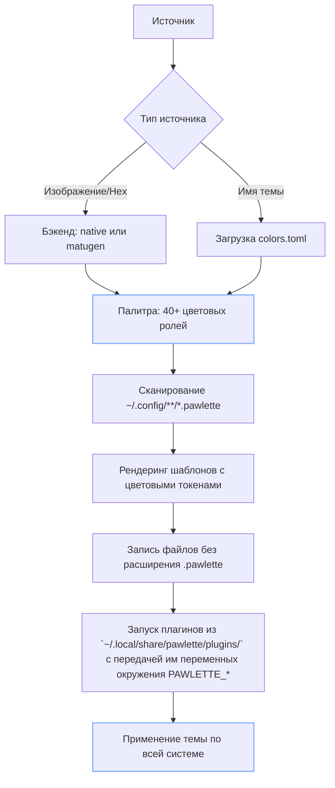

<div align="center">

# 🐾 Pawlette

**Универсальный менеджер тем в Linux** \
**Под капотом — гибкая система патчей и атомарные операции.**

[](https://github.com/meowrch/pawlette/issues)
[](https://github.com/meowrch/pawlette/stargazers)
[](./LICENSE)

[](./README.ru.md)
[](./README.md)

</div>


## 🌟 Возможности

- **🎨 Динамические палитры** — Извлечение цветов из обоев с помощью нативного PIL бэкенда или [matugen](https://github.com/InioX/matugen) (Material You)
- **📦 Статические темы** — Готовые темы в комплекте (Catppuccin, Gruvbox, Nord). Есть возможность создать свои.
- **🔧 Движок шаблонов** — Размещайте `.pawlette` файлы рядом с конфигами; pawlette рендерит их с цветовыми токенами и фильтрами
- **🗃️ Поддержка фильтров** — К цветовым переменным в шаблонах можно применить специальные фильтры.
- **🔌 Система плагинов** — Помещайте исполняемые файлы в `plugins/`; они получают палитру через переменные окружения
- **📂 XDG-совместимость** — Все пути следуют спецификации XDG Base Directory; полностью переопределяемы для тестирования

## Установка

### Требования

- Python 3.10+
- Библиотека Pillow
- [matugen](https://github.com/InioX/matugen) (опционально, для Material You бэкенда)

### Arch Linux

```bash
yay -S pawlette
```

### Из исходников

```bash
git clone https://github.com/meowrch/pawlette
cd pawlette
uv sync
uv run pawlette --help
```

## Быстрый старт

```bash
# Применить тему из обоев (нативный бэкенд, тёмный режим)
pawlette apply image ~/wallpapers/mountain.jpg

# Применить с matugen бэкендом и светлым режимом
pawlette apply image ~/wallpapers/mountain.jpg --backend matugen --mode light

# Применить из hex цвета
pawlette apply hex "#cba6f7"

# Применить статическую тему
pawlette apply theme catppuccin-mocha

# Пере-рендерить шаблоны без повторного извлечения палитры
pawlette render
```

## Как это работает

Pawlette следует трёхэтапному конвейеру:



## Конфигурация

Конфигурация опциональна. Создайте `~/.config/pawlette/pawlette.toml` для установки значений по умолчанию:

```toml
# Бэкенд по умолчанию (переопределяется флагом --backend)
backend = "native"  # или "matugen"

# Режим по умолчанию (переопределяется флагом --mode)
mode = "dark"  # или "light"

# Настройки бэкендов
[backends.matugen]
# Предпочтение цвета при нескольких доминирующих цветах
prefer = "saturation"  # darkness, lightness, saturation, less-saturation, value, closest-to-fallback

# Запасной цвет для "closest-to-fallback"
fallback_color = "#cba6f7"

# Настройки плагинов
[plugins.telegram]
template_dir = "~/.config/tg-config/"
output = "~/.config/tg-config/pawlette.tdesktop-theme"
background_image = "~/Pictures/wallpaper.jpg"
```

См. [`pawlette.toml.example`](pawlette.toml.example) для полного справочника.

### Приоритет CLI

Настройки разрешаются в следующем порядке:
1. Аргументы CLI (наивысший приоритет)
2. Файл конфигурации (`pawlette.toml`)
3. Жёстко заданные значения по умолчанию (низший приоритет)

## Система шаблонов

### Создание шаблонов

Размещайте `.pawlette` файлы рядом с вашими конфигами. Pawlette сканирует `~/.config` рекурсивно и рендерит их:

```
~/.config/polybar/config.ini          ← сгенерированный (не редактировать)
~/.config/polybar/config.ini.pawlette ← шаблон (редактировать этот)
```

### Синтаксис шаблонов

Используйте `{{токен}}` для подстановки цветов с опциональными фильтрами:

```ini
[colors]
background = {{color_bg}}
foreground = {{color_text}}
primary = {{color_primary}}
alert = {{color_red}}

# С фильтрами
background-alt = {{color_bg | lighten 10}}
border = {{color_primary | alpha 80}}
rgb-color = {{color_primary | rgb}}
```

### Доступные фильтры

| Фильтр | Пример | Результат |
|--------|--------|-----------|
| `alpha N` | `{{color_primary \| alpha 80}}` | `#cba6f7cc` (80% прозрачность) |
| `lighten N` | `{{color_bg \| lighten 20}}` | Осветлён на 20% |
| `darken N` | `{{color_text \| darken 15}}` | Затемнён на 15% |
| `strip` | `{{color_primary \| strip}}` | `cba6f7` (без #) |
| `rgb` | `{{color_primary \| rgb}}` | `203,166,247` |
| `uppercase` | `{{color_primary \| uppercase}}` | `#CBA6F7` |

### Цепочки фильтров

Комбинируйте несколько фильтров через `|`:

```
{{color_primary | darken 15 | strip}}                    → 9e7ec5
{{color_primary | darken 10 | strip | uppercase}}        → A882D4
{{color_bg | alpha 90 | uppercase}}                      → #1E1E2Ee6
```

### Примеры шаблонов

См. [`examples/configs`](examples/configs) для готовых шаблонов:
- `alacritty/` — Эмулятор терминала
- `kitty/` — Эмулятор терминала
- `hyprland/` — Wayland композитор
- `gtk-3.0/`, `gtk-4.0/` — GTK темы
- `fish/`, `zsh/` — Темы оболочек

## Справочник цветовой палитры

Pawlette предоставляет 40+ цветовых ролей, организованных в три категории:

### UI роли (13 цветов)

| Переменная | Описание | Использование |
|------------|----------|---------------|
| `color_bg` | Самый глубокий фон | Фон окна, фон терминала |
| `color_bg_alt` | Панели, боковые панели | На шаг светлее bg |
| `color_surface` | Кнопки, поля ввода | Интерактивные элементы |
| `color_surface_alt` | Наведение / приподнятая поверхность | Состояния наведения, приподнятые карточки |
| `color_text` | Основной читаемый текст | Основной цвет текста |
| `color_text_muted` | Вторичный текст | Плейсхолдеры, описания |
| `color_text_subtle` | Отключённый, подписи | Отключённый текст, тонкие подсказки |
| `color_primary` | Основной акцент | Активные вкладки, выделение, ссылки |
| `color_secondary` | Вторичный акцент | Альтернативные выделения |
| `color_border_active` | Граница активного окна | Граница окна в фокусе |
| `color_border_inactive` | Граница неактивного окна | Граница окна не в фокусе |
| `color_cursor` | Курсор терминала / редактора | Цвет курсора |
| `color_selection_bg` | Фон выделения текста | Фон выделенного текста |

### ANSI 16 (Цвета терминала)

| Переменная | Описание |
|------------|----------|
| `ansi_color0` | Чёрный (фон терминала) |
| `ansi_color1` | Красный |
| `ansi_color2` | Зелёный |
| `ansi_color3` | Жёлтый |
| `ansi_color4` | Синий |
| `ansi_color5` | Пурпурный |
| `ansi_color6` | Голубой |
| `ansi_color7` | Белый (текст терминала) |
| `ansi_color8` | Яркий чёрный (тусклый фон) |
| `ansi_color9` | Яркий красный |
| `ansi_color10` | Яркий зелёный |
| `ansi_color11` | Яркий жёлтый |
| `ansi_color12` | Яркий синий |
| `ansi_color13` | Яркий пурпурный |
| `ansi_color14` | Яркий голубой |
| `ansi_color15` | Яркий белый (яркий текст) |

### Семантические цвета (6 цветов)

**Всегда истинные оттенки** — никогда не являются псевдонимами ANSI цветов. Генерируются на фиксированных целевых оттенках (0°, 120°, 225° и т.д.) с использованием насыщенности primary.

| Переменная | Оттенок | Использование |
|------------|---------|---------------|
| `color_red` | 0° | Ошибки, удаления, предупреждения |
| `color_green` | 120° | Успех, добавления, подтверждения |
| `color_yellow` | 60° | Предупреждения, изменения |
| `color_blue` | 225° | Информация, ссылки, функции |
| `color_cyan` | 185° | Подсказки, строки |
| `color_magenta` | 300° | Специальное, ключевые слова |

**Почему семантические цвета генерируются:**

Material You (matugen) сдвигает ВСЕ цвета к доминирующему оттенку обоев. Это нарушает цветовые ассоциации:
- Красный становится розовым на фиолетовых обоях
- Зелёный становится мятным на фиолетовых обоях
- Git диффы, подсветка синтаксиса становятся неузнаваемыми

Pawlette генерирует семантические цвета на **фиксированных оттенках**, но использует **насыщенность/яркость от primary** для гармонии с темой. Результат: цвета узнаваемы (красный = красный), но визуально согласованы.

## Система плагинов

### Как работают плагины

Плагины — это **любые исполняемые файлы** в `~/.local/share/pawlette/plugins/`:
- Shell скрипты (`.sh`)
- Python скрипты (`.py`)
- Скомпилированные бинарники

Pawlette запускает их последовательно и передаёт палитру через переменные окружения.

### Контракт плагина

**Вход:**
- Получает переменные окружения `PAWLETTE_COLOR_*` и `PAWLETTE_ANSI_COLOR*` (в верхнем регистре)
- Получает специфичные для плагина настройки как переменные `PAWLETTE_PLUGIN_*` из `[plugins.<имя>]` в `pawlette.toml`

**Выход:**
- Код выхода 0 = успех
- Не ноль = ошибка (логируется)
- Stdout/stderr захватываются и логируются

**Таймаут:** 30 секунд на плагин (настраивается)

### Переменные окружения

Все цвета палитры передаются как переменные окружения в верхнем регистре:

```bash
# UI роли
PAWLETTE_COLOR_BG="#1e1e2e"
PAWLETTE_COLOR_BG_ALT="#181825"
PAWLETTE_COLOR_SURFACE="#313244"
PAWLETTE_COLOR_SURFACE_ALT="#45475a"
PAWLETTE_COLOR_TEXT="#cdd6f4"
PAWLETTE_COLOR_TEXT_MUTED="#a6adc8"
PAWLETTE_COLOR_TEXT_SUBTLE="#585b70"
PAWLETTE_COLOR_PRIMARY="#cba6f7"
PAWLETTE_COLOR_SECONDARY="#89b4fa"
PAWLETTE_COLOR_BORDER_ACTIVE="#cba6f7"
PAWLETTE_COLOR_BORDER_INACTIVE="#45475a"
PAWLETTE_COLOR_CURSOR="#cdd6f4"
PAWLETTE_COLOR_SELECTION_BG="#cba6f7"

# ANSI 16
PAWLETTE_ANSI_COLOR0="#1e1e2e"
PAWLETTE_ANSI_COLOR1="#f38ba8"
PAWLETTE_ANSI_COLOR2="#a6e3a1"
PAWLETTE_ANSI_COLOR3="#f9e2af"
PAWLETTE_ANSI_COLOR4="#89b4fa"
PAWLETTE_ANSI_COLOR5="#cba6f7"
PAWLETTE_ANSI_COLOR6="#94e2d5"
PAWLETTE_ANSI_COLOR7="#cdd6f4"
PAWLETTE_ANSI_COLOR8="#313244"
PAWLETTE_ANSI_COLOR9="#f38ba8"
PAWLETTE_ANSI_COLOR10="#a6e3a1"
PAWLETTE_ANSI_COLOR11="#f9e2af"
PAWLETTE_ANSI_COLOR12="#89b4fa"
PAWLETTE_ANSI_COLOR13="#cba6f7"
PAWLETTE_ANSI_COLOR14="#94e2d5"
PAWLETTE_ANSI_COLOR15="#cdd6f4"

# Семантические цвета
PAWLETTE_COLOR_RED="#f05b5b"
PAWLETTE_COLOR_GREEN="#5bf05b"
PAWLETTE_COLOR_YELLOW="#f0f05b"
PAWLETTE_COLOR_BLUE="#5b5bf0"
PAWLETTE_COLOR_CYAN="#5bf0f0"
PAWLETTE_COLOR_MAGENTA="#f05bf0"
```

### Создание плагина

#### Пример 1: Shell скрипт

```bash
#!/bin/bash
# ~/.local/share/pawlette/plugins/hyprland.sh

# Установить цвета границ Hyprland
if pgrep -x "Hyprland" > /dev/null; then
    if command -v hyprctl &> /dev/null; then
        hyprctl keyword general:col.active_border "rgb(${PAWLETTE_COLOR_BORDER_ACTIVE#\#})"
        hyprctl keyword general:col.inactive_border "rgb(${PAWLETTE_COLOR_BORDER_INACTIVE#\#})"
    fi
fi

# Перезагрузить waybar
if pgrep -x "waybar" > /dev/null; then
    killall -SIGUSR2 waybar
fi
```

Сделайте исполняемым:
```bash
chmod +x ~/.local/share/pawlette/plugins/hyprland.sh
```

#### Пример 2: Python скрипт

```python
#!/usr/bin/env python3
# ~/.local/share/pawlette/plugins/gtk-theme.py

import os
import subprocess

primary = os.environ["PAWLETTE_COLOR_PRIMARY"]
bg = os.environ["PAWLETTE_COLOR_BG"]

# Применить GTK тему
subprocess.run(["gsettings", "set", "org.gnome.desktop.interface", "gtk-theme", "Adwaita-dark"])
subprocess.run(["gsettings", "set", "org.gnome.desktop.interface", "color-scheme", "prefer-dark"])

print(f"Применена GTK тема с primary={primary}")
```

**Примечание:** Python плагинам не нужен shebang — pawlette вызывает их с текущим интерпретатором автоматически (с поддержкой virtualenv).

#### Пример 3: Плагин с конфигом

**Конфиг в `~/.config/pawlette/pawlette.toml`:**
```toml
[plugins.telegram]
template_dir = "~/.config/tg-config/"
output = "~/.config/tg-config/pawlette.tdesktop-theme"
background_image = "~/Pictures/wallpaper.jpg"
background_max_px = 2560
```

**Плагин получает как переменные окружения:**
```bash
PAWLETTE_PLUGIN_TEMPLATE_DIR="~/.config/tg-config/"
PAWLETTE_PLUGIN_OUTPUT="~/.config/tg-config/pawlette.tdesktop-theme"
PAWLETTE_PLUGIN_BACKGROUND_IMAGE="~/Pictures/wallpaper.jpg"
PAWLETTE_PLUGIN_BACKGROUND_MAX_PX="2560"
```

**Скрипт плагина:**
```python
#!/usr/bin/env python3
import os

template_dir = os.environ["PAWLETTE_PLUGIN_TEMPLATE_DIR"]
output = os.environ["PAWLETTE_PLUGIN_OUTPUT"]
bg_image = os.environ["PAWLETTE_PLUGIN_BACKGROUND_IMAGE"]

# Использовать значения конфига...
```

### Именование плагинов

Имя плагина берётся из имени файла (без расширения):
- `telegram.py` → секция конфига `[plugins.telegram]`
- `gtk-reload.sh` → секция конфига `[plugins.gtk-reload]`

## Статические темы

### Использование встроенных тем

```bash
pawlette apply theme catppuccin-mocha
pawlette apply theme gruvbox-dark
pawlette apply theme nord
```

### Создание пользовательских тем

1. Создайте директорию темы:
```bash
mkdir -p ~/.local/share/pawlette/themes/my-theme
```

2. Создайте `colors.toml` со всеми полями палитры:
```toml
[colors]
# UI роли
color_bg = "#1e1e2e"
color_bg_alt = "#181825"
color_surface = "#313244"
color_surface_alt = "#45475a"
color_text = "#cdd6f4"
color_text_muted = "#a6adc8"
color_text_subtle = "#585b70"
color_primary = "#cba6f7"
color_secondary = "#89b4fa"
color_border_active = "#cba6f7"
color_border_inactive = "#45475a"
color_cursor = "#cdd6f4"
color_selection_bg = "#cba6f7"

# ANSI 16
ansi_color0 = "#1e1e2e"
ansi_color1 = "#f38ba8"
ansi_color2 = "#a6e3a1"
ansi_color3 = "#f9e2af"
ansi_color4 = "#89b4fa"
ansi_color5 = "#cba6f7"
ansi_color6 = "#94e2d5"
ansi_color7 = "#cdd6f4"
ansi_color8 = "#313244"
ansi_color9 = "#f38ba8"
ansi_color10 = "#a6e3a1"
ansi_color11 = "#f9e2af"
ansi_color12 = "#89b4fa"
ansi_color13 = "#cba6f7"
ansi_color14 = "#94e2d5"
ansi_color15 = "#cdd6f4"

# Семантические цвета
color_red = "#f38ba8"
color_green = "#a6e3a1"
color_yellow = "#f9e2af"
color_blue = "#89b4fa"
color_cyan = "#94e2d5"
color_magenta = "#cba6f7"
```

3. (Опционально) Создайте `meta.toml`:
```toml
name = "Моя тема"
author = "Ваше имя"
description = "Красивая пользовательская тема"
```

4. Применить:
```bash
pawlette apply theme my-theme
```

## Структура директорий

```
~/.config/pawlette/
├── pawlette.toml              ← Конфигурация пользователя (опционально)
└── **/*.pawlette              ← Файлы шаблонов (разбросаны по ~/.config)

~/.local/share/pawlette/
├── themes/                    ← Определения статических тем
│   ├── catppuccin-mocha/
│   │   ├── colors.toml
│   │   └── meta.toml
│   ├── gruvbox-dark/
│   └── nord/
└── plugins/                   ← Исполняемые плагины
    ├── hyprland.sh
    ├── gtk-reload.sh
    └── telegram.py

~/.local/state/pawlette/
└── active_palette.json        ← Кэшированная активная палитра (для `pawlette render`)

~/.cache/pawlette/
└── matugen_output.json        ← Кэш JSON от matugen
```

## Продвинутое использование

### Пробный запуск

Предпросмотр того, что будет сделано, без внесения изменений:

```bash
pawlette apply image ~/wallpaper.jpg --dry-run --print-palette
```

### Изолированное тестирование

Переопределите XDG пути для тестирования без влияния на конфиг пользователя:

```bash
XDG_CONFIG_HOME=/tmp/test/config \
XDG_DATA_HOME=/tmp/test/data \
XDG_STATE_HOME=/tmp/test/state \
XDG_CACHE_HOME=/tmp/test/cache \
pawlette apply theme catppuccin-mocha
```

См. [docs/isolated-testing.md](docs/isolated-testing.md) для полного руководства.

### Сравнение бэкендов

**Нативный бэкенд** (по умолчанию):
- Быстрый, без внешних зависимостей
- PIL median-cut квантизация + k-means кластеризация
- Хорош для большинства обоев

**Matugen бэкенд**:
- Алгоритм Material You
- Требует внешний бинарник
- Лучше для сложных изображений с несколькими доминирующими цветами

```bash
# Нативный
pawlette apply image ~/wallpaper.jpg --backend native

# Matugen с предпочтением насыщенности
pawlette apply image ~/wallpaper.jpg --backend matugen --matugen-prefer saturation
```

## Разработка

### Настройка

```bash
# Клонировать и установить зависимости
git clone https://github.com/meowrch/pawlette
cd pawlette
uv sync
```

### Запуск тестов

```bash
# Запустить все тесты
pytest

# Запустить с покрытием
pytest --cov=pawlette --cov-report=term-missing

# Запустить конкретный тестовый файл
pytest tests/test_template_engine.py
```

### Структура проекта

```
src/pawlette/
├── extraction/          # Этап 1: Извлечение палитры
│   ├── palette.py       # Dataclass палитры
│   ├── native.py        # Нативный PIL бэкенд
│   └── matugen.py       # Matugen бэкенд
├── rendering/           # Этап 2: Рендеринг шаблонов
│   ├── templates.py     # Движок шаблонов
│   └── themes.py        # Загрузчик статических тем
├── plugins/             # Этап 3: Выполнение плагинов
│   └── runner.py        # Запускатель плагинов
├── cli/                 # Интерфейс командной строки
│   └── main.py          # Точка входа CLI
└── core/                # Общие утилиты
    ├── config.py        # Загрузка конфигурации
    └── xdg.py           # Утилиты XDG путей
```

## Благодарности
- [matugen](https://github.com/InioX/matugen) — Извлечение цветов Material You
- Вдохновлено [pywal](https://github.com/dylanaraps/pywal) и [flavours](https://github.com/Misterio77/flavours)


## ☕ Поддержать проект
Если Pawlette делает ваш рабочий стол красивее:
| Криптовалюта | Адрес                                              |
| ------------ | -------------------------------------------------- |
| **TON**      | `UQB9qNTcAazAbFoeobeDPMML9MG73DUCAFTpVanQnLk3BHg3` |
| **Ethereum** | `0x56e8bf8Ec07b6F2d6aEdA7Bd8814DB5A72164b13`       |
| **Bitcoin**  | `bc1qt5urnw7esunf0v7e9az0jhatxrdd0smem98gdn`       |
| **Tron**     | `TBTZ5RRMfGQQ8Vpf8i5N8DZhNxSum2rzAs`               |

Ваша поддержка мотивирует нас делать больше крутых фич! ❤️

## 📊 Статистика
[](https://star-history.com/#meowrch/pawlette&Date)